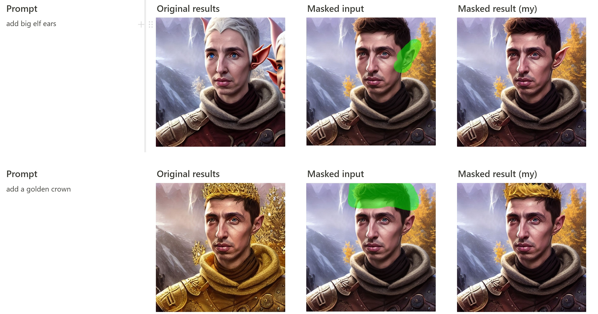
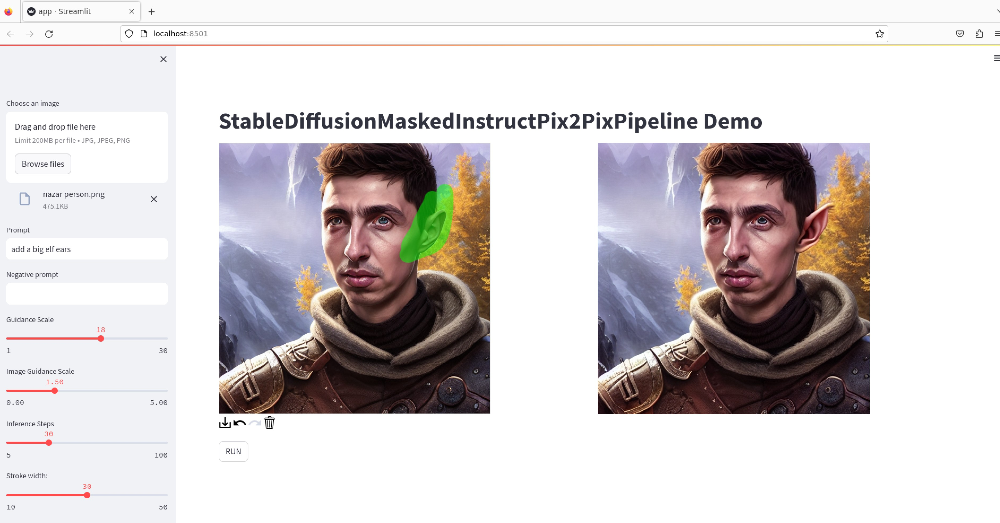

## Pipeline for masked pixel-level image editing by following text instructions

Based on the [original instruct pix2pix pipeline](https://github.com/huggingface/diffusers/blob/main/src/diffusers/pipelines/stable_diffusion/pipeline_stable_diffusion_instruct_pix2pix.py)  from diffusers library.
API is identical to the original one, except the mask parameter, that specifies region to be edited.

### Comparing results


### Web demo

Install all requirements and run
```angular2html
streamlit run app.py
```
